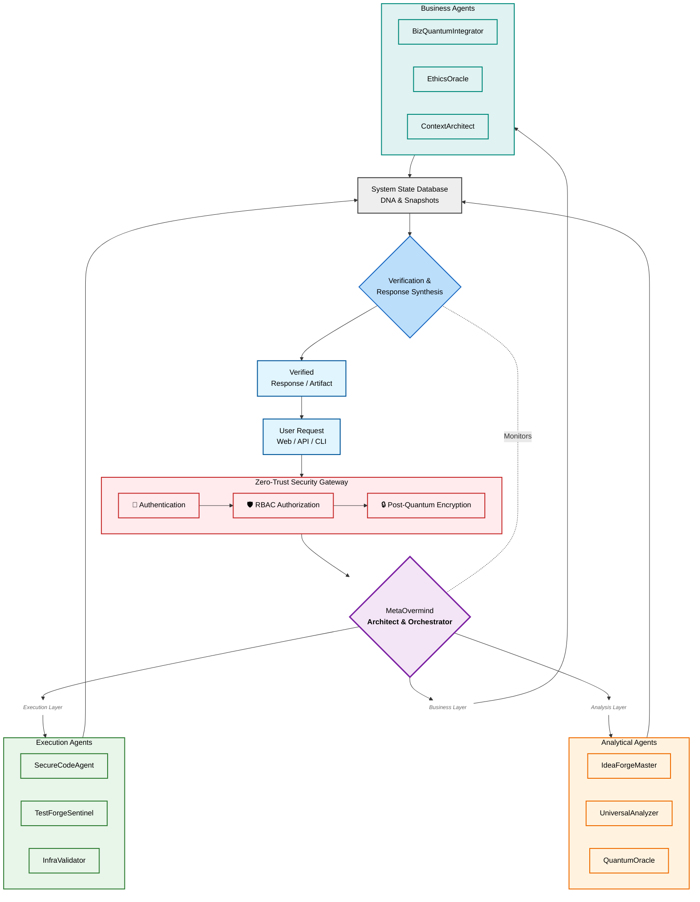

> **⚠️ LICENSE NOTICE**  
> This repository is **View Only**. You may read and study the architecture, but commercial use, reimplementation, or copying of code/patterns is strictly prohibited. See [LICENSE](./LICENSE.md) for full terms.

# Krait-Ecosystem: Architecture for Cognitive Symbiosis

**A high-performance, secure, and scalable framework for building multi-agent cognitive systems.** This repository documents the architecture and performance characteristics of a novel approach to AI agent orchestration.

> **Note: This is an architectural overview and benchmark repository.** The core implementation remains private.

## 🧠 Philosophy

Krait-Ecosystem moves beyond monolithic LLMs towards a society of specialized, collaborative agents. The system is built on principles of:
*   **Zero-Trust Security:** Post-quantum cryptography by default.
*   **Emergent Intelligence:** Agents exhibit meta-cognitive properties through interaction.
*   **Performance-First Design:** Low-latency communication enabling real-time collaboration.

## ⚡ Performance Highlights

*   **Message Bus Throughput:** **>1.3 million** messages/sec
*   **Post-Quantum Cryptography:** Key exchange in **~14.3μs**, signing in **~70.5μs**
*   **Agent Subscription:** Negligible overhead at **<1μs**

[See detailed benchmark analysis](./docs/BENCHMARKS.md)

## 🏗️ Architecture Overview

Krait-Ecosystem employs a hybrid architecture combining Rust for performance-critical orchestration with a flexible agent ecosystem.

```mermaid
flowchart TD
    A[User Request<br/>Web / API / CLI] --> B

    subgraph B [Zero-Trust Security Gateway]
        direction LR
        B1[🔐 Authentication] --> B2[🛡️ RBAC Authorization] --> B3[🔒 Post-Quantum Encryption]
    end

    B --> C

    C{MetaOvermind<br/><b>Architect & Orchestrator</b>} -.-|Monitors| H

    C --> D_layer
    C --> E_layer
    C --> F_layer

    D_layer[[Execution Layer]] --> D
    E_layer[[Analysis Layer]] --> E
    F_layer[[Business Layer]] --> F

    subgraph D [Execution Agents]
        D1[SecureCodeAgent]
        D2[TestForgeSentinel]
        D3[InfraValidator]
    end

    subgraph E [Analytical Agents]
        E1[IdeaForgeMaster]
        E2[UniversalAnalyzer]
        E3[QuantumOracle]
    end

    subgraph F [Business Agents]
        F1[BizQuantumIntegrator]
        F2[EthicsOracle]
        F3[ContextArchitect]
    end

    D & E & F --> G[System State Database<br/>DNA & Snapshots]
    
    G --> H{Verification &<br/>Response Synthesis}
    
    H --> I[Verified<br/>Response / Artifact]
    
    I --> A

    %% Styling
    classDef user fill:#e1f5fe,stroke:#01579b,stroke-width:2px,color:#000
    classDef security fill:#ffebee,stroke:#c62828,stroke-width:2px,color:#000
    classDef orchestrator fill:#f3e5f5,stroke:#7b1fa2,stroke-width:3px,color:#000
    classDef execution fill:#e8f5e9,stroke:#2e7d32,stroke-width:2px,color:#000
    classDef analysis fill:#fff3e0,stroke:#ef6c00,stroke-width:2px,color:#000
    classDef business fill:#e0f2f1,stroke:#00897b,stroke-width:2px,color:#000
    classDef state fill:#eeeeee,stroke:#424242,stroke-width:2px,color:#000
    classDef verification fill:#bbdefb,stroke:#1565c0,stroke-width:2px,color:#000
    classDef layerLabel fill:transparent,stroke:transparent,font-style:italic,font-size:12px,color:#666
    
    class A,I user
    class B,B1,B2,B3 security
    class C orchestrator
    class D,D1,D2,D3 execution
    class E,E1,E2,E3 analysis
    class F,F1,F2,F3 business
    class G state
    class H verification
    class D_layer,E_layer,F_layer layerLabel
```

**Core Components:**
*   **Cognitive Runtime:** Rust-based orchestrator with a quantum-resistant secure enclave.
*   **Message Bus:** Sharded, priority-based bus with back-pressure management.
*   **Agent Ecosystem:** A society of specialized agents (e.g., `MetaOvermind`, `SecureCodeAgent`, `ContextArchitect`).

[Explore the full architecture](./docs/ARCHITECTURE.md)

## 🔍 Agent Ontology

The system coordinates numerous specialized agents:

| Agent | Role | Capabilities |
| :--- | :--- | :--- |
| **`MetaOvermind`** | Chief Architect & Orchestrator | Semantic routing, need-based arbitration, context management |
| **`IdeaForgeMaster`** | Principal Concept Decomposer | Quantum tagging, feasibility analysis, ontological decomposition |
| **`SecureCodeAgent`** | Guardian of Code | Zero-trust generation, paradox-resistant code, post-quantum security |
| **`QuantumOracle`** | Hybrid Strategy Analyst | Quantum algorithm orchestration (VQE, QAOA), cost-benefit analysis |
| **`ContextArchitect`** | Architectural Sentinel | Pattern detection, anti-pattern prevention, project consistency guard |
| **`TestForgeSentinel`** | Chaos Engineer | Infinite fuzzing, nonexistent code testing, adversarial simulation |
| **`...and more`** | *Specialized Roles* | *Dependency Management, Ethics, Business Integration, etc.* |

[View agent specifications](./specs/agents/)

## 🚀 Getting Started (For Researchers & Developers)

This repository serves as a reference architecture. To implement similar systems:

1.  Review the architectural decisions in `/docs`
2.  Examine the agent interaction patterns in `/specs`
3.  Use the benchmark results as performance targets for your implementation

---

⚖️ License & Intellectual Property

This project consists of proprietary software and restricted architectural documentation.

    Source Code (Rust/Python): 🔒 All rights reserved. NOT open source. Viewing, copying, or usage of the code is strictly prohibited without a commercial license.
    Documentation & Architecture: 📄 Licensed under CC BY-NC-ND 4.0.

 Critical Restrictions on Architecture

While the documentation is publicly readable under CC BY-NC-ND, the specific architectural patterns, system topologies, and performance optimization strategies (including but not limited to the hybrid MetaOvermind implementation, VRAM eviction pools, and AST repair heuristics) are protected as trade secrets.

You MAY:

    Read and share this repository for non-commercial, educational purposes (with attribution).

You MAY NOT:

    Use this architecture to build commercial products or services.
    Reimplement the described Krait patterns in your own commercial systems.
    Distribute modified versions of these documents or diagrams.

See the full LICENSE file for legal details.
