# Krait-Ecosystem: Architecture for Cognitive Symbiosis

**A high-performance, secure, and scalable framework for building multi-agent cognitive systems.** This repository documents the architecture and performance characteristics of a novel approach to AI agent orchestration.

> **Note: This is an architectural overview and benchmark repository.** The core implementation remains private.

## 🧠 Philosophy

Krait-Ecosystem moves beyond monolithic LLMs towards a society of specialized, collaborative agents. The system is built on principles of:
*   **Zero-Trust Security:** Post-quantum cryptography by default.
*   **Emergent Intelligence:** Agents exhibit meta-cognitive properties through interaction.
*   **Performance-First Design:** Low-latency communication enabling real-time collaboration.

## ⚡ Performance Highlights

*   **Message Bus Throughput:** **>1.3 million** messages/sec
*   **Post-Quantum Cryptography:** Key exchange in **~14.3μs**, signing in **~70.5μs**
*   **Agent Subscription:** Negligible overhead at **<1μs**

[See detailed benchmark analysis](./docs/BENCHMARKS.md)

## 🏗️ Architecture Overview

Krait-Ecosystem employs a hybrid architecture combining Rust for performance-critical orchestration with a flexible agent ecosystem.

```mermaid
flowchart TD
    A[User Request<br/>Web / API / CLI] --> B

    subgraph B [Zero-Trust Security Gateway]
        direction LR
        B1[🔐 Authentication] --> B2[🛡️ RBAC Authorization] --> B3[🔒 Post-Quantum Encryption]
    end

    B --> C

    C{MetaOvermind<br/><b>Architect & Orchestrator</b>} -.-|Monitors| H

    C --> D_layer
    C --> E_layer
    C --> F_layer

    D_layer[[Execution Layer]] --> D
    E_layer[[Analysis Layer]] --> E
    F_layer[[Business Layer]] --> F

    subgraph D [Execution Agents]
        D1[SecureCodeAgent]
        D2[TestForgeSentinel]
        D3[InfraValidator]
    end

    subgraph E [Analytical Agents]
        E1[IdeaForgeMaster]
        E2[UniversalAnalyzer]
        E3[QuantumOracle]
    end

    subgraph F [Business Agents]
        F1[BizQuantumIntegrator]
        F2[EthicsOracle]
        F3[ContextArchitect]
    end

    D & E & F --> G[System State Database<br/>DNA & Snapshots]
    
    G --> H{Verification &<br/>Response Synthesis}
    
    H --> I[Verified<br/>Response / Artifact]
    
    I --> A

    %% Styling
    classDef user fill:#e1f5fe,stroke:#01579b,stroke-width:2px,color:#000
    classDef security fill:#ffebee,stroke:#c62828,stroke-width:2px,color:#000
    classDef orchestrator fill:#f3e5f5,stroke:#7b1fa2,stroke-width:3px,color:#000
    classDef execution fill:#e8f5e9,stroke:#2e7d32,stroke-width:2px,color:#000
    classDef analysis fill:#fff3e0,stroke:#ef6c00,stroke-width:2px,color:#000
    classDef business fill:#e0f2f1,stroke:#00897b,stroke-width:2px,color:#000
    classDef state fill:#eeeeee,stroke:#424242,stroke-width:2px,color:#000
    classDef verification fill:#bbdefb,stroke:#1565c0,stroke-width:2px,color:#000
    classDef layerLabel fill:transparent,stroke:transparent,font-style:italic,font-size:12px,color:#666
    
    class A,I user
    class B,B1,B2,B3 security
    class C orchestrator
    class D,D1,D2,D3 execution
    class E,E1,E2,E3 analysis
    class F,F1,F2,F3 business
    class G state
    class H verification
    class D_layer,E_layer,F_layer layerLabel
```

**Core Components:**
*   **Cognitive Runtime:** Rust-based orchestrator with a quantum-resistant secure enclave.
*   **Message Bus:** Sharded, priority-based bus with back-pressure management.
*   **Agent Ecosystem:** A society of specialized agents (e.g., `MetaOvermind`, `SecureCodeAgent`, `ContextArchitect`).

[Explore the full architecture](./docs/ARCHITECTURE.md)

## 🔍 Agent Ontology

The system coordinates numerous specialized agents:

| Agent | Role | Capabilities |
| :--- | :--- | :--- |
| **`MetaOvermind`** | Chief Architect & Orchestrator | Semantic routing, need-based arbitration, context management |
| **`IdeaForgeMaster`** | Principal Concept Decomposer | Quantum tagging, feasibility analysis, ontological decomposition |
| **`SecureCodeAgent`** | Guardian of Code | Zero-trust generation, paradox-resistant code, post-quantum security |
| **`QuantumOracle`** | Hybrid Strategy Analyst | Quantum algorithm orchestration (VQE, QAOA), cost-benefit analysis |
| **`ContextArchitect`** | Architectural Sentinel | Pattern detection, anti-pattern prevention, project consistency guard |
| **`TestForgeSentinel`** | Chaos Engineer | Infinite fuzzing, nonexistent code testing, adversarial simulation |
| **`...and more`** | *Specialized Roles* | *Dependency Management, Ethics, Business Integration, etc.* |

[View agent specifications](./specs/agents/)

## 🚀 Getting Started (For Researchers & Developers)

This repository serves as a reference architecture. To implement similar systems:

1.  Review the architectural decisions in `/docs`
2.  Examine the agent interaction patterns in `/specs`
3.  Use the benchmark results as performance targets for your implementation

Contact: denfar28@gmail.com

## 📄 License

Architectural documentation is licensed under CC-BY-4.0. All implementation rights reserved.
