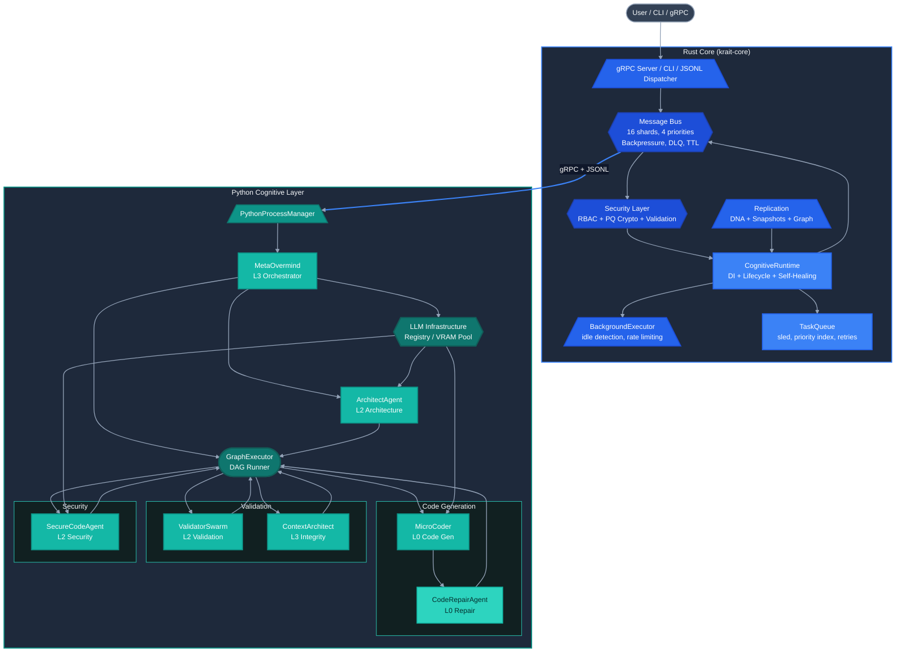
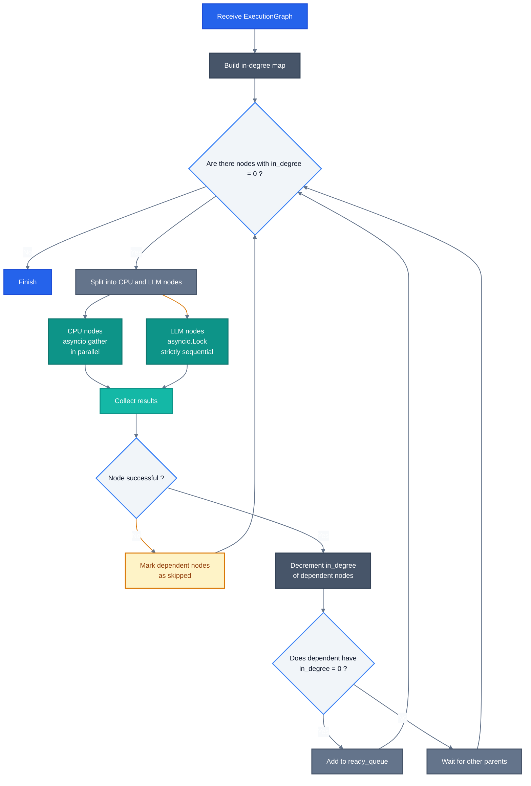
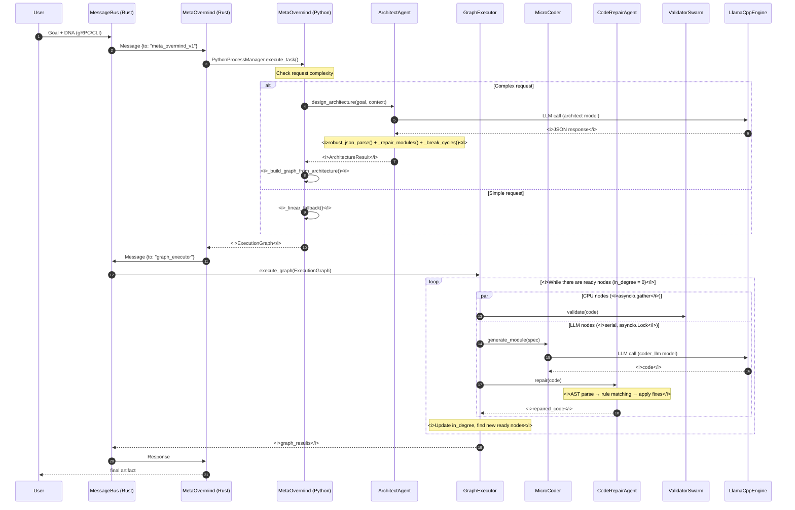

# Krait Architecture: Hybrid Runtime for Multi-Agent Code Generation
# Krait Architecture: Hybrid Runtime for Multi-Agent Code Generation

**Architectural document. Version: engineering review based on source code.**

---

## 1. What problems the system solves

Krait is not a monolithic code generator, but a distributed hybrid runtime that solves a specific set of engineering problems arising when attempting to automate the creation of software systems using LLMs:

1. **Architectural inconsistency of LLM output.** Language models generate modules in isolation, without a global understanding of the system. Krait introduces an intermediate architectural design layer (`ArchitectAgent`) which, before code generation, fixes modules, interfaces, and dependencies, and then controls their compliance.
2. **Syntactic and structural validity.** Raw LLM output often contains broken imports, undefined symbols, and style violations. The system uses a deterministic post-processor (`CodeRepairAgent`) and a multi-level validator (`ValidatorSwarm`) that work without repeated model calls.
3. **Limitations of local GPU resources.** Running multiple specialized models (planner, architect, coder, security analyzer) on a single accelerator requires strict VRAM management. The `ModelRegistry` with `LlamaCppPool` implements LRU eviction, monitoring via NVML, and KV-cache reuse.
4. **Reliable orchestration of dependent tasks.** System generation is a DAG with different types of nodes: LLM-intensive (code generation) and CPU-intensive (static analysis). The `GraphExecutor` serializes the former via `asyncio.Lock` and parallelizes the latter via `asyncio.gather`.
5. **Persistence of agent state and recovery.** Agents have state (DNA) that must be preserved between sessions. The Rust core provides snapshots with checksums, incremental deltas, and background recovery (`Self-Healing Supervisor`).
6. **Configuration validation and artifact integrity.** In a multi-agent system, agents generate configurations and code. `RBAC` with capability-based access and post-quantum cryptography (`Kyber-1024`, `Dilithium-3`) ensure provenance control and the impossibility of substitution.

---

## 2. High-level architecture

The system is divided into two layers interacting through `PythonProcessManager`, gRPC, and JSON-serialized tasks.



**Separation principle:**
- **Rust** is responsible for non-deterministic external effects: transport, persistence, cryptography, task scheduling, and process lifecycle.
- **Python** is responsible for cognitive operations: LLM-based planning, architectural design, code generation and repair, and static analysis.

---

## 3. Horizontal slice: agent levels

Agents in the system are organized into three levels based on the principle of responsibility and proximity to the LLM:

```mermaid%%{init: {'theme': 'base', 'themeVariables': {
  'lineColor': '#94A3B8',
  'primaryColor': '#3B82F6',
  'primaryTextColor': '#FFFFFF',
  'primaryBorderColor': '#2563EB',
  'secondaryColor': '#0D9488',
  'tertiaryColor': '#0F172A',
  'fontFamily': 'system-ui, -apple-system, sans-serif',
  'fontSize': '14px',
  'edgeLabelBackground': '#0F172A'
}}}%%

flowchart TD
    subgraph L3 ["L3: Orchestration and strategy"]
        MO["MetaOvermind<br/>Hybrid orchestrator"]
        CA_L3["ContextArchitect<br/>Guardian of integrity"]
        BQI["BizQuantumIntegrator<br/>Business analytics"]
        QO["QuantumOracle<br/>Quantum algorithms"]
    end

    subgraph L2 ["L2: Specialized agents"]
        AA["ArchitectAgent<br/>Architectural design"]
        SCA["SecureCodeAgent<br/>Hybrid audit"]
        IFM["IdeaForgeMaster<br/>Idea generator"]
        UA["UniversalAnalyzer<br/>Analogies and metaphors"]
        VS["ValidatorSwarm<br/>Multi-level validation"]
    end

    subgraph L0 ["L0: Executors"]
        MC_L0["MicroCoder<br/>Code generator"]
        CRA_L0["CodeRepairAgent<br/>Deterministic repair"]
        GE["GraphExecutor<br/>DAG runner"]
    end

    %% --- Main flows ---
    MO -->|"plans"| AA
    MO -->|"delegates"| GE
    
    GE -->|"runs"| MC_L0
    GE -->|"runs"| VS
    GE -->|"runs"| CA_L3
    GE -->|"runs"| SCA
    
    MC_L0 -->|"result"| CRA_L0
    CRA_L0 -->|"fixed code"| VS

    %% --- Auxiliary flows ---
    AA -.->|"uses"| IFM
    SCA -.->|"uses"| UA
    QO -.->|"is used"| BQI

    %% --- Classes for L3 (Blue) ---
    classDef l3Primary fill:#2563EB,stroke:#1D4ED8,stroke-width:2px,color:#FFFFFF
    classDef l3Secondary fill:#3B82F6,stroke:#2563EB,stroke-width:2px,color:#FFFFFF
    classDef l3Sub fill:#1E293B,stroke:#3B82F6,stroke-width:2px,color:#F8FAFC

    %% --- Classes for L2 (Teal) ---
    classDef l2Primary fill:#0D9488,stroke:#0F766E,stroke-width:2px,color:#FFFFFF
    classDef l2Secondary fill:#14B8A6,stroke:#0D9488,stroke-width:2px,color:#FFFFFF
    classDef l2Sub fill:#1E293B,stroke:#0D9488,stroke-width:2px,color:#F8FAFC

    %% --- Classes for L0 (Gray/Slate) ---
    classDef l0Primary fill:#475569,stroke:#334155,stroke-width:2px,color:#FFFFFF
    classDef l0Secondary fill:#64748B,stroke:#475569,stroke-width:2px,color:#FFFFFF
    classDef l0Sub fill:#1E293B,stroke:#64748B,stroke-width:2px,color:#F8FAFC

    %% --- Applying classes to nodes ---
    class MO,QO l3Primary
    class CA_L3,BQI l3Secondary
    class L3 l3Sub

    class AA,VS l2Primary
    class SCA,IFM,UA l2Secondary
    class L2 l2Sub

    class MC_L0,GE l0Primary
    class CRA_L0 l0Secondary
    class L0 l0Sub

    %% --- Line styling ---
    %% Indices: 0:MO->AA, 1:MO->GE, 2:GE->MC, 3:GE->VS, 4:GE->CA, 5:GE->SCA, 6:MC->CRA, 7:CRA->VS, 8:AA->IFM, 9:SCA->UA, 10:QO->BQI
    linkStyle 0,1,2,3,4,5,6,7 stroke:#94A3B8,stroke-width:1.5px
    linkStyle 8,9,10 stroke:#64748B,stroke-width:1.5px,stroke-dasharray:5 4
```

## 4. Rust Core: Deterministic runtime

### 4.1. Message Bus

The central element of communication. All agents and components communicate exclusively through the asynchronous bus.

- **Sharding:** 16 shards. Subscribers are distributed by agent ID hash, reducing contention.
- **Prioritization:** 4 levels — `Low`, `Normal`, `High`, `Critical`. Processing occurs in priority order.
- **Backpressure:** Semaphore with a limit of 10,000 messages per shard.
- **TTL and Dead Letter Queue:** Messages with an expired TTL are not lost but moved to the DLQ for analysis.
- **Payload:** `MessagePayload` supports Text, Binary, Command, Response, Error, Json.

**Bus Performance** (`MessageBus_RealWorld` benchmarks):

- **Throughput:** **1.14 million msg/s** in competitive mode (8 producers, 16 agents).
- **Sub-linear degradation:** 100,000 subscriber agents slow down the processing of a 10K message batch by only 16.8 times compared to 4 agents (from 7.7ms to 129.5ms).
- **p99 Latency:** < **6.4ms** for critical messages even under load.

---

### 4.2. Task Queue & Scheduler

Persistent task queue based on `sled`:

- **Indexes:** `priority_index`, `status_index`, `source_index` — separate sled trees for fast queries.
- **Task fields:** `goal`, `priority`, `urgency`, `assigned_agent`, `plan`, `current_step`, `retry_count`, `max_retries`, `parent_task_id`, `subtasks`, `tags`.
- **Background Executor:** An autonomous loop that picks up tasks from the queue upon detecting an idle system state. Supports rate limiting (`tasks_per_hour`, `max_concurrent_tasks`) and has an auto-recovery mode (creates recovery tasks when the retry limit is exceeded).

---

### 4.3. Cognitive Runtime

DI container and lifecycle manager:

- **Agent Registry:** Agent factory via `SpawnRequest`. Allows registering new types without changing the core code.
- **Maintenance Loop (every 30 seconds):** Health check of critical agents, dead-letter queue cleanup, deletion of old DNA records, TaskQueue monitoring.
- **Metrics Loop (every 10 seconds):** Collection of statistics on active agents and DNA storage.
- **Self-Healing:** Upon detecting a dead critical agent, `resurrect_agent` is called, which restores the state from the last DNA snapshot and recreates the agent.

---

### 4.4. MetaOvermind (hybrid agent)

`MetaOvermind` is a **Hybrid agent implemented simultaneously in two languages**:

- **Rust part** (`cognitive_runtime` module): receives messages from the bus, manages correlation IDs for asynchronous requests, interacts with `TaskQueue` and `PythonProcessManager`. Contains `AgentRegistry` and agent spawn/stop logic.
- **Python part** (`metaovermind.py` module): performs cognitive planning — analyzes the goal, determines the complexity of the request, calls `ArchitectAgent` for architectural design or builds a linear fallback, and forms an `ExecutionGraph` for `GraphExecutor`.

This separation allows the Rust part to work with delivery guarantees and timeouts, while the Python part uses LLMs and complex logic without blocking the bus.

---

## 5. Security Model

Security is built into the architecture at the `krait-core` crate level, not added on top.

### 5.1. Post-quantum cryptography

- **Kyber-1024:** Key exchange (`kyber_encapsulate` / `kyber_decapsulate`). Key generation — **14 µs**, encapsulation — **13 µs**, decapsulation — **14 µs**.
- **Dilithium-3:** Digital signatures (`dilithium_sign` / `dilithium_verify`). Signing 1KB — **51 µs**.
- **Blake3:** Hashing of artifacts and messages.
- **Zeroize:** Secret keys are cleared when the `Keypair` structure is Dropped.

---

### 5.2. RBAC

Role model with capability-based access:

- **Roles:** `untrusted` (only SendMessage, SystemInfo), `trusted` (+ FileRead, Networking, SpawnAgent), `privileged` (+ FileWrite), `test`.
- **Capabilities:** `Networking`, `FileWrite`, `FileRead`, `SpawnAgent`, `SendMessage`, `SystemInfo`.
- **Check:** When spawning an agent, `role.capabilities.check(&Capability::SpawnAgent)` is called. A rights error returns `PermissionError::Missing`.

---

### 5.3. Validation and watermarks

- **validate_agent_config:** Checking ID format via regex, filtering injections via a static `QSC_TOKENS` table, CRUX context compression (replacing keywords with markers without parsing), paradox detection (`parent_id = agent_id`).
- **Watermark:** Signing artifacts via Dilithium + blake3 hash. Allows verifying the provenance of an artifact. Used for code artifacts.

---

## 6. Replication and State

### 6.1. DNA Manager

Agent state management (`AgentDna`):

- **Storage:** `sled` with separate trees for DNA (`dna_tree`), indexes (`index_tree`), and quantum superpositions (`quantum_tree`).
- **Compression:** `zstd` level 3.
- **Caching:** LRU for 1000 DNA records (100 for superpositions).
- **Incrementality:** Support for `DnaDelta` — saving only changes relative to the base snapshot. Recovery via `restore_from_deltas` (apply all deltas to the base DNA).
- **Background tasks:** Periodic cleanup of outdated records (`cleanup_old`) by TTL, zero-fold compression of old DNA (removal of temporary fields).
- **Integrity:** The sha256 checksum is recalculated on every save and checked on load.

---

### 6.2. DNA Snapshot

File snapshot manager:

- **Serialization:** MessagePack.
- **Integrity:** CRC32 for each snapshot (first 4 bytes of the file).
- **Snapshot types:** Full (`save_full` / `load_full`), incremental (`save_incremental`), system (`save_full_system` — snapshot of the entire runtime state).
- **Batch write:** `save_batch` with a durability guarantee (fsync).

---

### 6.3. Knowledge Graph

Persistent graph on `sled`:

- **Nodes:** Agents, patterns, modules. Key: `n:{id}`.
- **Edges:** Dependencies, connections. Key: `e:{from}:{to}`.
- **Indexes:** Secondary index by node type for fast queries.
- **Queries:** Searching for agents by pattern (`agents_with_pattern` — substring search in data), searching for dependencies (`dependents` — who depends on the specified agent).
- **SyncEngine:** Comparison of local and remote `GraphState` via `blake3` hashes, calculating the divergence level (`None`, `Minor`, `Major`). Node intersection > 90% — Minor, otherwise Major.

---

## 7. Python Cognitive Layer

The Python layer is the "brain" of the system, responsible for request processing, planning, code generation, and validation.

### 7.1. ArchitectAgent

Architectural design generator:

- **Input:** Goal, context, existing modules, constraints.
- **Output:** `ArchitectureResult` with a list of `ModuleSpec`, `InterfaceSpec`, `MethodSpec`, `DependencySpec`.
- **Styles:** `MICROSERVICES`, `MONOLITHIC`, `LAYERED`, `HEXAGONAL`, `EVENT_DRIVEN`, `CQRS`, `MODULAR_MONOLITH`.
- **Adaptivity:** The prompt is selected depending on the system complexity (simple/medium/complex), limiting the number of modules (max 5, 12, 16 respectively).

**LLM response parsing safety (`robust_json_parse`):**

1. Direct `json.loads`.
2. Extraction from markdown blocks ````json ... ````.
3. Removal of `<think>` tags.
4. Removal of `//` and `/* */` comments.
5. Searching for a JSON object via a bracket stack (correctly handles nested structures).
6. Greedy search for all fragments resembling JSON, taking the longest one.

**Invariants and auto-repair (`_repair_modules`):**

- Every module must have at least one interface (automatically creates `{module_name}_interface`).
- Missing dependencies are restored from the declared dependencies of the modules.
- If there are no dependencies at all, they are created based on layers (presentation → application → domain → infrastructure).

**Cycle detection and breaking (`_break_cycles_in_graph`):**

- DFS along the dependency graph with color marking (0=unvisited, 1=in_stack, 2=processed).
- Upon detecting a cycle, the last edge of the cycle is removed.
- Removed edges are logged with a warning.

---

### 7.2. GraphExecutor

DAG Executor:



- **VRAM Protection:** All nodes requiring an LLM are executed under a global `asyncio.Lock`, which prevents the simultaneous loading of multiple models into VRAM.
- **CPU Parallelism:** Lightweight checks (Style, Logic, ContextArchitect) are executed concurrently.
- **State Routing:** Node results are passed only to direct dependencies via `_parent_results` .

### 7.3. CodeRepairAgent

A deterministic post-processor that works without an LLM:

```mermaid
%%{init: {'theme': 'base', 'themeVariables': {
  'lineColor': '#64748B',
  'primaryColor': '#3B82F6',
  'primaryTextColor': '#FFFFFF',
  'primaryBorderColor': '#2563EB',
  'secondaryColor': '#0D9488',
  'tertiaryColor': '#0F172A',
  'fontFamily': 'system-ui, -apple-system, sans-serif',
  'fontSize': '14px',
  'edgeLabelBackground': '#F8FAFC'
}}}%%

flowchart LR
    A["LLM output"] --> B["AST parse"]
    B --> C{"Syntax valid?"}
    
    C -- Yes --> D["Apply rules"]
    C -- No --> E["_fix_syntax_error"]
    
    E --> D
    
    D --> F["AST re-parse"]
    F --> G{"Valid?"}
    
    G -- Yes --> H["Return fixed code"]
    G -- No --> I["Return original with warning"]

    %% ===== GRAY (Basic operations) =====
    style A fill:#475569,stroke:#334155,stroke-width:2px,color:#FFFFFF
    style B fill:#64748B,stroke:#475569,stroke-width:2px,color:#FFFFFF
    style F fill:#64748B,stroke:#475569,stroke-width:2px,color:#FFFFFF

    %% ===== CONDITIONS =====
    style C fill:#F1F5F9,stroke:#3B82F6,stroke-width:2px,color:#0F172A
    style G fill:#F1F5F9,stroke:#3B82F6,stroke-width:2px,color:#0F172A

    %% ===== YELLOW (Errors and warnings) =====
    style E fill:#FEF3C7,stroke:#D97706,stroke-width:2px,color:#92400E
    style I fill:#FEF3C7,stroke:#D97706,stroke-width:2px,color:#92400E

    %% ===== TEAL (Repair) =====
    style D fill:#0D9488,stroke:#0F766E,stroke-width:2px,color:#FFFFFF

    %% ===== BLUE (Success) =====
    style H fill:#2563EB,stroke:#1D4ED8,stroke-width:2px,color:#FFFFFF

    linkStyle default stroke:#64748B,stroke-width:1.5px
```



**10 built-in rules:**

1. `_apply_add_global_alias` — creating aliases for imported classes
2. `_apply_add_repository_stub` — creating stubs for repository classes
3. `_apply_add_exception` — adding auto-generated exceptions
4. `_apply_replace_text` — replacing imports according to a mapping
5. `_apply_template_file` — applying templates for known modules
6. `_apply_fix_short_file` — fixing files that are too short (adding pass)
7. `_apply_add_method_alias` — creating aliases for methods
8. `_apply_add_missing_imported_function_alias` — stubs for imported functions
9. `_apply_add_missing_class` — creating missing classes
10. `_apply_create_missing_dependency_module` — creating entire stub modules for missing dependencies

**Extensibility:** Custom rules are loaded from a JSON file.

---

### 7.4. ValidatorSwarm

Multi-level validation:

- **StyleValidator:** Style checking (regex-based).
- **LogicValidator:** Static analysis of logical errors (AST).
- **BestPracticesValidator:** Compliance with best practices.
- **SpecComplianceValidator:** Checking compliance with the specification. If the LLM (`tiny_classifier`) is unavailable — fallback to keyword-based analysis on the CPU.
- **Modes:** `QUICK` (Style only), `STANDARD` (+ Logic + Practices), `DEEP` (+ SpecCompliance with LLM).
- **Output:** `ValidationResult` with `overall_grade` (0.0-1.0), a list of `QualityIssue` (severity: `CRITICAL`, `HIGH`, `MEDIUM`, `LOW`, `INFO`), and an `approved` flag.

---

### 7.5. ContextArchitect

Guardian of architectural integrity, works in two modes:

**Ephemeral Mode (for GraphExecutor):**

- In-memory graph checking for cycles (DFS) and god objects (analysis of method_count and dependency_count).
- Does not save state, does not touch the Knowledge Graph.
- Execution time: microseconds.

**Autonomous Mode (background daemon):**

- Accumulates a history of architectural decisions (`self.nodes`, `self.edges`).
- Saves snapshots to the KnowledgeGraph via gRPC.
- Identifies hidden anti-patterns (cycles, god objects, deep nesting).

---

### 7.6. SecureCodeAgent

Two-stage security analysis:

- **Rust Fast Path:** Code is sent to the Rust core, which performs static analysis in microseconds (AST, searching for dangerous patterns via tree-sitter/syn).
- **LLM Deep Path:** Sequentially or in parallel, the code is analyzed by a specialized LLM (`security_llm`) to find complex vulnerabilities.
- **Result:** Merging and ranking by criticality (Critical > High > Medium > Low). Rust findings receive a confidence bonus (+20%).

`robust_json_parse` is used to parse LLM responses with multi-level recovery.

---

## 8. LLM Infrastructure and Resource Management

### 8.1. Models and Engines

- **LlamaCppEngine:** Local inference via `llama-cpp-python`. Supports GPU-offload (`n_gpu_layers`), FlashAttention, YaRN, rope scaling. The KV-cache is cleared using the `reset()` method without unloading the model. Generation timeout: 600 seconds.
- **VllmEngine:** Integration with `vLLM` (`AsyncLLMEngine`).
- **ApiEngine:** Cloud providers (OpenAI, Anthropic) via `aiohttp`.
- **AutoEngine:** Automatic engine selection. Priority is given to local inference; fallback to `MockApiEngine`.

---

### 8.2. ModelRegistry and VRAM Management

- **Singleton.** Provides a single point of access to all LLMs.
- **LlamaCppPool:** Pool with LRU eviction. In case of VRAM shortage (monitoring via `pynvml` / `NVML`), it unloads rarely used models.
- **Reuse:** A single physical model can be used for different roles (`architect`, `coder_llm`, `planner`) by clearing the KV-cache without reloading into VRAM.
- **Fallback chain:** If the requested model is unavailable, it goes down the `MODEL_FALLBACK_CHAIN`.
- **Tiers:** `TINY`, `SMALL`, `MEDIUM`, `LARGE`, `XLARGE` — for task-based selection.

---

### 8.3. Caching

- **CacheLayer:** Two-level cache (Redis + in-memory fallback). If Redis is unavailable, it works on local memory. Default TTL: 300 seconds.
- **AutoEngine:** Additionally caches created engines in `_engine_cache`.

---

## 9. Request Execution Flow (End-to-End)




---

## 10. Tooling and Observability

- **Prometheus:** Latency metrics, errors, VRAM utilization (in `ModelRegistry` and LLM engines). Microcoder metrics port: 9091.
- **Tracing:** `tokio/tracing` with `max_level_debug` / `release_max_level_debug` level. Structured logs with correlation ID.
- **Benchmarks:** A set of Criterion benchmarks:
  - `message_bus_bench` — bus throughput.
  - `crypto_bench` — PQ operations.
  - `replication_bench` — DNA save/load.
  - `agents_bench` — agent lifecycle.
  - `grpc_bench` — gRPC throughput.
  - `runtime_bench` — integration scenarios.
- **Integration test suite:** `StrictSystemBuilderTest` — a full run of generating 6 systems of varying complexity with checks for syntactic validity, import connectivity, method coverage, and ontological compliance.

---

## 11. Conclusion

Krait is a hybrid multi-agent system where the Rust core takes on infrastructure reliability (communications, persistence, security, scheduling), and the Python layer takes on cognitive logic (architectural design, code generation, validation). The key engineering emphasis is placed on managing limited GPU resources (VRAM eviction, serialization of LLM nodes), guaranteeing the syntactic validity of the output (deterministic repair + multi-level validation), and controlled orchestration of complex workflows (DAG with dependencies and fallback chains).

The hybrid implementation of `MetaOvermind` allows combining Rust's guaranteed delivery and timeouts with the cognitive flexibility of Python/LLM. The three levels of agents (L0-executors, L2-specialists, L3-strategists) form a complete pipeline: from the user's goal to a syntactically valid multi-module project with cross-imports and a verified architecture.


---

### 12. Quantum Components Implementation Status

**Regarding quantum computing, to avoid any misunderstanding: these are primarily simulations. The architecture includes provisions for future QPU integration.**

---

### 🟡 Working (Simulation / MVP)
- `QuantumOracle` — VQE/QAOA on PennyLane simulator (GPU/CPU)
- `BizQuantumIntegrator` — LLM-based business requirement translation into technical solutions, Knowledge Graph integration, compliance stubs

### 🔴 Stubs / Requires Further Work
- `QuantumOracle`: Grover (limited to 10 qubits), IBM/IonQ/Rigetti adapters (awaiting API tokens)
- `BizQuantumIntegrator`: quantum Monte Carlo (uses simulator), quantum speedup (heuristic)
- `GDPRChecker` / `PCIChecker` — API ready, business logic not implemented

### 📌 Note
Quantum algorithms run **only in simulation mode** on CPU/GPU.  
Real QPU integration (IBM, IonQ, Rigetti) is planned for the future, but requires:
1. Obtaining API tokens
2. Testing on actual quantum hardware
3. Adaptation to real qubit noise

The current implementation is suitable for:
- Research prototypes
- Architecture demonstrations
- Learning and experiments

---

*The project is under active development. Component status is updated as implementation progresses.*
