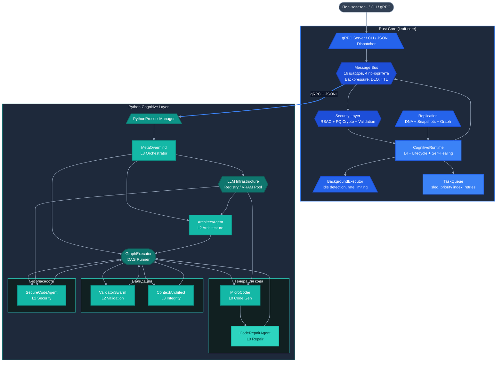
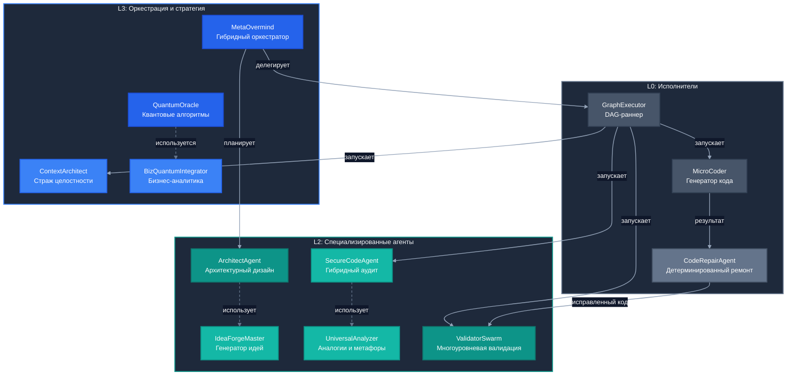
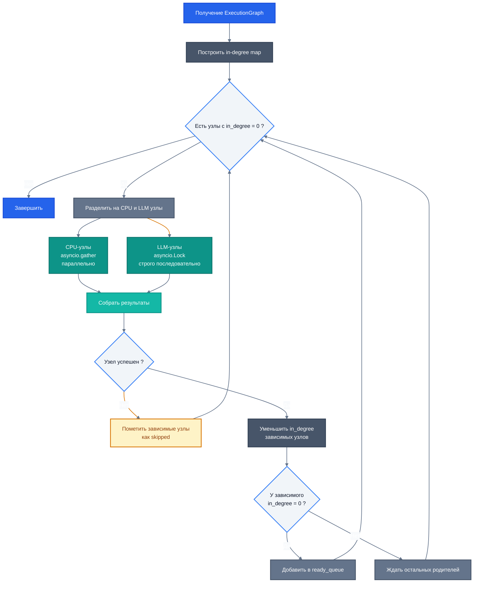
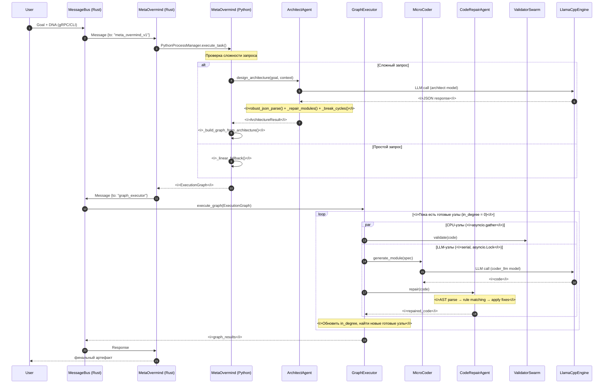

# Krait Architecture: Hybrid Runtime for Multi-Agent Code Generation

**Архитектурный документ. Версия: инженерный обзор на основе исходного кода.**

---

## 1. Какие проблемы решает система

Krait — это не монолитный генератор кода, а распределённый гибридный runtime, который решает конкретный набор инженерных проблем, возникающих при попытке автоматизировать создание программных систем с помощью LLM:

1. **Архитектурная несогласованность выхода LLM.** Языковые модели генерируют модули изолированно, без глобального представления о системе. Krait вводит промежуточный слой архитектурного проектирования (`ArchitectAgent`), который до генерации кода фиксирует модули, интерфейсы и зависимости, а затем контролирует их соблюдение.
2. **Синтаксическая и структурная валидность.** Сырой выход LLM часто содержит битые импорты, неопределённые символы, нарушения стиля. Система использует детерминированный постпроцессор (`CodeRepairAgent`) и многоуровневый валидатор (`ValidatorSwarm`), работающие без повторных вызовов модели.
3. **Ограниченность локальных GPU-ресурсов.** Запуск нескольких специализированных моделей (планировщик, архитектор, кодер, security-анализатор) на одном ускорителе требует жёсткого управления VRAM. `ModelRegistry` с `LlamaCppPool` реализует LRU-эвикцию, мониторинг через NVML и переиспользование KV-кэша.
4. **Надёжная оркестрация зависимых задач.** Генерация системы — это DAG с разными типами узлов: LLM-интенсивные (генерация кода) и CPU-интенсивные (статический анализ). `GraphExecutor` сериализует первые через `asyncio.Lock` и параллелит вторые через `asyncio.gather`.
5. **Персистентность состояния агентов и восстановление.** Агенты имеют состояние (DNA), которое должно сохраняться между сессиями. Rust-ядро обеспечивает снапшоты с контрольными суммами, инкрементальные дельты и фоновое восстановление (`Self-Healing Supervisor`).
6. **Валидация конфигураций и целостность артефактов.** В мультиагентной системе агенты порождают конфигурации и код. `RBAC` с capability-based доступом и постквантовая криптография (`Kyber-1024`, `Dilithium-3`) обеспечивают контроль происхождения и невозможность подмены.

---

## 2. Высокоуровневая архитектура

Система разделена на два слоя, взаимодействующих через `PythonProcessManager`, gRPC и JSON-сериализованные задачи.



**Принцип разделения:**
- **Rust** отвечает за недетерминированные внешние эффекты: транспорт, персистентность, криптографию, планирование задач, жизненный цикл процессов.
- **Python** отвечает за когнитивные операции: планирование через LLM, архитектурный дизайн, генерацию и ремонт кода, статический анализ.

---

## 3. Горизонтальный срез: уровни агентов

Агенты в системе организованы в три уровня по принципу ответственности и близости к LLM:



**Принцип взаимодействия:** агенты общаются через шину сообщений (Rust), напрямую не вызывая друг друга. `MetaOvermind` и `GraphExecutor` — единственные компоненты, которые координируют выполнение; остальные агенты — stateless-обработчики, получающие контекст через параметры вызова.

---

## 4. Rust Core: Детерминированный runtime

### 4.1. Message Bus

Центральный элемент коммуникации. Все агенты и компоненты общаются исключительно через асинхронную шину.

- **Шардирование:** 16 шардов. Подписчики распределены по хешу ID агента, что снижает contention.
- **Приоритизация:** 4 уровня — `Low`, `Normal`, `High`, `Critical`. Обработка в порядке приоритета.
- **Backpressure:** Semaphore с лимитом 10000 сообщений на шард.
- **TTL и Dead Letter Queue:** Сообщения с истёкшим TTL не теряются, а перемещаются в DLQ для анализа.
- **Полезная нагрузка:** `MessagePayload` поддерживает Text, Binary, Command, Response, Error, Json.

**Производительность шины** (бенчмарки `MessageBus_RealWorld`):
- **Пропускная способность:** **1.14 млн msg/s** в конкурентном режиме (8 продюсеров, 16 агентов).
- **Сублинейная деградация:** 100,000 агентов-подписчиков замедляют обработку пакета из 10K сообщений всего в 16.8 раз по сравнению с 4 агентами (с 7.7ms до 129.5ms).
- **Задержка p99:** < **6.4ms** для критических сообщений даже под нагрузкой.

### 4.2. Task Queue & Scheduler

Персистентная очередь задач на базе `sled`:
- **Индексы:** `priority_index`, `status_index`, `source_index` — отдельные sled-деревья для быстрых запросов.
- **Поля задачи:** `goal`, `priority`, `urgency`, `assigned_agent`, `plan`, `current_step`, `retry_count`, `max_retries`, `parent_task_id`, `subtasks`, `tags`.
- **Background Executor:** Автономный цикл, который забирает задачи из очереди при обнаружении idle-состояния системы. Поддерживает rate limiting (`tasks_per_hour`, `max_concurrent_tasks`), имеет режим auto-recovery (создаёт recovery-задачи при превышении лимита попыток).

### 4.3. Cognitive Runtime

DI-контейнер и менеджер жизненного цикла:
- **Agent Registry:** Фабрика агентов через `SpawnRequest`. Позволяет регистрировать новые типы без изменения кода ядра.
- **Maintenance Loop (каждые 30 секунд):** Проверка здоровья критических агентов, очистка dead-letter очереди, удаление старых DNA-записей, мониторинг TaskQueue.
- **Metrics Loop (каждые 10 секунд):** Сбор статистики по активным агентам и DNA-хранилищу.
- **Self-Healing:** При обнаружении мёртвого критического агента вызывается `resurrect_agent`, который восстанавливает состояние из последнего DNA-снапшота и пересоздаёт агента.

### 4.4. MetaOvermind (гибридный агент)

`MetaOvermind` — **Гибридный агент, реализованный в двух языках одновременно**:

- **Rust-часть** (модуль `cognitive_runtime`): получает сообщения из шины, управляет correlation ID для асинхронных запросов, взаимодействует с `TaskQueue` и `PythonProcessManager`. Содержит `AgentRegistry` и логику спавна/остановки агентов.
- **Python-часть** (модуль `metaovermind.py`): выполняет когнитивное планирование — анализирует цель, определяет сложность запроса, вызывает `ArchitectAgent` для архитектурного проектирования или строит линейный fallback, формирует `ExecutionGraph` для `GraphExecutor`.

Такое разделение позволяет Rust-части работать с гарантией доставки и таймаутами, а Python-части — использовать LLM и сложную логику без блокировки шины.

---

## 5. Модель безопасности

Безопасность встроена в архитектуру на уровне крейта `krait-core`, а не добавлена поверх.

### 5.1. Постквантовая криптография

- **Kyber-1024:** Обмен ключами (`kyber_encapsulate` / `kyber_decapsulate`). Генерация ключа — **14 µs**, инкапсуляция — **13 µs**, декапсуляция — **14 µs**.
- **Dilithium-3:** Цифровые подписи (`dilithium_sign` / `dilithium_verify`). Подпись 1KB — **51 µs**.
- **Blake3:** Хэширование артефактов и сообщений.
- **Zeroize:** Секретные ключи очищаются при Drop структуры `Keypair`.

### 5.2. RBAC

Ролевая модель с capability-based доступом:
- **Роли:** `untrusted` (только SendMessage, SystemInfo), `trusted` (+ FileRead, Networking, SpawnAgent), `privileged` (+ FileWrite), `test`.
- **Capabilities:** `Networking`, `FileWrite`, `FileRead`, `SpawnAgent`, `SendMessage`, `SystemInfo`.
- **Проверка:** При спавне агента вызывается `role.capabilities.check(&Capability::SpawnAgent)`. Ошибка прав возвращает `PermissionError::Missing`.

### 5.3. Валидация и водяные знаки

- **validate_agent_config:** Проверка формата ID через regex, фильтрация инъекций через статическую таблицу `QSC_TOKENS`, CRUX-сжатие контекста (замена ключевых слов на маркеры без парсинга), обнаружение парадоксов (parent_id = agent_id).
- **Watermark:** Подпись артефактов через Dilithium + blake3-хэш. Позволяет верифицировать происхождение артефакта. Используется для code artifacts.

---

## 6. Репликация и состояние

### 6.1. DNA Manager

Управление состоянием агентов (`AgentDna`):
- **Хранилище:** `sled` с отдельными деревьями для DNA (`dna_tree`), индексов (`index_tree`) и квантовых суперпозиций (`quantum_tree`).
- **Сжатие:** `zstd` level 3.
- **Кэширование:** LRU на 1000 записей DNA (по 100 для суперпозиций).
- **Инкрементальность:** Поддержка `DnaDelta` — сохранение только изменений относительно базового снапшота. Восстановление через `restore_from_deltas` (apply всех дельт к базовому DNA).
- **Фоновые задачи:** Периодическая очистка устаревших записей (`cleanup_old`) по TTL, zero-fold-сжатие старых DNA (удаление временных полей).
- **Целостность:** Контрольная сумма sha256 пересчитывается при каждом сохранении и проверяется при загрузке.

### 6.2. DNA Snapshot

Файловый менеджер снапшотов:
- **Сериализация:** MessagePack.
- **Целостность:** CRC32 для каждого снапшота (первые 4 байта файла).
- **Виды снапшотов:** Полные (`save_full` / `load_full`), инкрементальные (`save_incremental`), системные (`save_full_system` — снепшот всего состояния рантайма).
- **Пакетная запись:** `save_batch` с гарантией durability (fsync).

### 6.3. Knowledge Graph

Персистентный граф на `sled`:
- **Узлы:** Агенты, паттерны, модули. Ключ: `n:{id}`.
- **Рёбра:** Зависимости, связи. Ключ: `e:{from}:{to}`.
- **Индексы:** Вторичный индекс по типу узла для быстрых запросов.
- **Запросы:** Поиск агентов по паттерну (`agents_with_pattern` — поиск подстроки в data), поиск зависимостей (`dependents` — кто зависит от указанного агента).
- **SyncEngine:** Сравнение локального и удалённого `GraphState` через хэши `blake3`, вычисление уровня дивергенции (`None`, `Minor`, `Major`). Пересечение узлов > 90% — Minor, иначе Major.

---

## 7. Python Cognitive Layer

Python-слой — это «мозг» системы, отвечающий за обработку запросов, планирование, генерацию и валидацию кода.

### 7.1. ArchitectAgent

Генератор архитектурного дизайна:
- **Вход:** Цель (goal), контекст, существующие модули, ограничения.
- **Выход:** `ArchitectureResult` со списком `ModuleSpec`, `InterfaceSpec`, `MethodSpec`, `DependencySpec`.
- **Стили:** `MICROSERVICES`, `MONOLITHIC`, `LAYERED`, `HEXAGONAL`, `EVENT_DRIVEN`, `CQRS`, `MODULAR_MONOLITH`.
- **Адаптивность:** Промпт подбирается в зависимости от сложности системы (simple/medium/complex), ограничивая число модулей (max 5, 12, 16 соответственно).

**Безопасность парсинга LLM-ответа (`robust_json_parse`):**
1. Прямой `json.loads`.
2. Извлечение из markdown-блоков ````json ... ````.
3. Удаление тегов `<think>`.
4. Удаление комментариев `//` и `/* */`.
5. Поиск JSON-объекта через стек скобок (корректно обрабатывает вложенные структуры).
6. Жадный поиск всех фрагментов, похожих на JSON, взятие самого длинного.

**Инварианты и авто-ремонт (`_repair_modules`):**
- Каждый модуль обязан иметь хотя бы один интерфейс (авто-создаётся `{module_name}_interface`).
- Отсутствующие зависимости восстанавливаются из declared dependencies модулей.
- Если зависимостей нет совсем, они создаются на основе слоёв (presentation → application → domain → infrastructure).

**Обнаружение и разрыв циклов (`_break_cycles_in_graph`):**
- DFS по графу зависимостей с цветовой маркировкой (0=unvisited, 1=in_stack, 2=processed).
- При обнаружении цикла удаляется последнее ребро цикла.
- Удалённые рёбра логируются с предупреждением.

### 7.2. GraphExecutor

Исполнитель DAG:



- **VRAM Protection:** Все узлы, требующие LLM, исполняются под глобальным `asyncio.Lock`, что предотвращает одновременную загрузку нескольких моделей в VRAM.
- **CPU Parallelism:** Лёгкие проверки (Style, Logic, ContextArchitect) выполняются конкурентно.
- **State Routing:** Результаты узлов передаются только прямым зависимостям через `_parent_results`.

### 7.3. CodeRepairAgent

Детерминированный постпроцессор, работающий без LLM:

```mermaid
%%{init: {'theme': 'base', 'themeVariables': {
  'lineColor': '#64748B',
  'primaryColor': '#3B82F6',
  'primaryTextColor': '#FFFFFF',
  'primaryBorderColor': '#2563EB',
  'secondaryColor': '#0D9488',
  'tertiaryColor': '#0F172A',
  'fontFamily': 'system-ui, -apple-system, sans-serif',
  'fontSize': '14px',
  'edgeLabelBackground': '#F8FAFC'
}}}%%

flowchart LR
    A["LLM output"] --> B["AST parse"]
    B --> C{"Синтаксис валиден?"}
    
    C -- Да --> D["Применить правила"]
    C -- Нет --> E["_fix_syntax_error"]
    
    E --> D
    
    D --> F["AST re-parse"]
    F --> G{"Валиден?"}
    
    G -- Да --> H["Вернуть исправленный код"]
    G -- Нет --> I["Вернуть оригинал с warning"]

    %% ===== СЕРОЕ (Базовые операции) =====
    style A fill:#475569,stroke:#334155,stroke-width:2px,color:#FFFFFF
    style B fill:#64748B,stroke:#475569,stroke-width:2px,color:#FFFFFF
    style F fill:#64748B,stroke:#475569,stroke-width:2px,color:#FFFFFF

    %% ===== УСЛОВИЯ =====
    style C fill:#F1F5F9,stroke:#3B82F6,stroke-width:2px,color:#0F172A
    style G fill:#F1F5F9,stroke:#3B82F6,stroke-width:2px,color:#0F172A

    %% ===== ЖЕЛТОЕ (Ошибки и предупреждения) =====
    style E fill:#FEF3C7,stroke:#D97706,stroke-width:2px,color:#92400E
    style I fill:#FEF3C7,stroke:#D97706,stroke-width:2px,color:#92400E

    %% ===== БИРЮЗОВОЕ (Ремонт) =====
    style D fill:#0D9488,stroke:#0F766E,stroke-width:2px,color:#FFFFFF

    %% ===== СИНЕЕ (Успех) =====
    style H fill:#2563EB,stroke:#1D4ED8,stroke-width:2px,color:#FFFFFF

    linkStyle default stroke:#64748B,stroke-width:1.5px
```



**10 встроенных правил:**
1. `_apply_add_global_alias` — создание алиасов для импортируемых классов
2. `_apply_add_repository_stub` — создание стабов для repository-классов
3. `_apply_add_exception` — добавление авто-сгенерированных исключений
4. `_apply_replace_text` — замена импортов по маппингу
5. `_apply_template_file` — применение шаблонов для известных модулей
6. `_apply_fix_short_file` — исправление слишком коротких файлов (добавление pass)
7. `_apply_add_method_alias` — создание алиасов для методов
8. `_apply_add_missing_imported_function_alias` — стабы для импортируемых функций
9. `_apply_add_missing_class` — создание отсутствующих классов
10. `_apply_create_missing_dependency_module` — создание целых модулей-заглушек для отсутствующих зависимостей

Расширяемость: кастомные правила загружаются из JSON-файла.

### 7.4. ValidatorSwarm

Многоуровневая валидация:
- **StyleValidator:** Проверка стиля (regex-based).
- **LogicValidator:** Статический анализ логических ошибок (AST).
- **BestPracticesValidator:** Соответствие best practices.
- **SpecComplianceValidator:** Проверка соответствия спецификации. При недоступности LLM (`tiny_classifier`) — fallback на keyword-based анализ на CPU.
- **Режимы:** `QUICK` (только Style), `STANDARD` (+ Logic + Practices), `DEEP` (+ SpecCompliance с LLM).
- **Выход:** `ValidationResult` с `overall_grade` (0.0-1.0), списком `QualityIssue` (severity: `CRITICAL`, `HIGH`, `MEDIUM`, `LOW`, `INFO`), флагом `approved`.

### 7.5. ContextArchitect

Страж архитектурной целостности, работает в двух режимах:

**Ephemeral Mode (для GraphExecutor):**
- In-memory проверка графа на циклы (DFS) и god-объекты (анализ method_count и dependency_count).
- Не сохраняет состояние, не трогает Knowledge Graph.
- Время выполнения: микросекунды.

**Autonomous Mode (фоновый демон):**
- Накапливает историю архитектурных решений (`self.nodes`, `self.edges`).
- Сохраняет снепшоты в KnowledgeGraph через gRPC.
- Выявляет скрытые антипаттерны (циклы, god objects, deep nesting).

### 7.6. SecureCodeAgent

Двухэтапный анализ безопасности:
- **Rust Fast Path:** Код отправляется в Rust-ядро, которое за микросекунды выполняет статический анализ (AST, поиск опасных паттернов через tree-sitter/syn).
- **LLM Deep Path:** Параллельно или последовательно код анализируется специализированной LLM (`security_llm`) для поиска сложных уязвимостей.
- **Результат:** Слияние и ранжирование по критичности (Critical > High > Medium > Low). Rust-находки получают бонус уверенности (+20%).

**robust_json_parse** используется для парсинга LLM-ответов с многоуровневым восстановлением.

---

## 8. LLM-инфраструктура и управление ресурсами

### 8.1. Модели и движки

- **LlamaCppEngine:** Локальный инференс через `llama-cpp-python`. Поддержка GPU-offload (`n_gpu_layers`), FlashAttention, YaRN, rope scaling. KV-кэш очищается методом `reset()` без выгрузки модели. Таймаут генерации: 600 секунд.
- **VllmEngine:** Интеграция с `vLLM` (`AsyncLLMEngine`).
- **ApiEngine:** Облачные провайдеры (OpenAI, Anthropic) через `aiohttp`.
- **AutoEngine:** Автоматический выбор движка. Приоритет локальному инференсу; fallback на `MockApiEngine`.

### 8.2. ModelRegistry и управление VRAM

- **Singleton.** Предоставляет единую точку доступа ко всем LLM.
- **LlamaCppPool:** Пул с LRU-эвикцией. При нехватке VRAM (мониторинг через `pynvml` / `NVML`) выгружает редко используемые модели.
- **Reuse:** Одна физическая модель может использоваться для разных ролей (`architect`, `coder_llm`, `planner`) путём очистки KV-кэша без перезагрузки в VRAM.
- **Fallback chain:** Если запрошенная модель недоступна, идёт по цепочке `MODEL_FALLBACK_CHAIN`.
- **Tiers:** `TINY`, `SMALL`, `MEDIUM`, `LARGE`, `XLARGE` — для выбора под задачу.

### 8.3. Кэширование

- **CacheLayer:** Двухуровневый кэш (Redis + in-memory fallback). При недоступности Redis работает на локальной памяти. TTL по умолчанию: 300 секунд.
- **AutoEngine:** Дополнительно кэширует созданные движки в `_engine_cache`.

---

## 9. Поток выполнения запроса (End-to-End)




---

## 10. Инструментарий и наблюдаемость

- **Prometheus:** Метрики latency, ошибок, загрузки VRAM (в `ModelRegistry` и LLM-движках). Порт метрик микрокодера: 9091.
- **Tracing:** `tokio/tracing` с уровнем `max_level_debug` / `release_max_level_debug`. Структурированные логи с correlation ID.
- **Benchmarks:** Набор Criterion-бенчмарков:
  - `message_bus_bench` — пропускная способность шины.
  - `crypto_bench` — PQ-операции.
  - `replication_bench` — DNA save/load.
  - `agents_bench` — жизненный цикл агентов.
  - `grpc_bench` — gRPC throughput.
  - `runtime_bench` — интеграционные сценарии.
- **Integration test suite:** `StrictSystemBuilderTest` — полный прогон генерации 6 систем разной сложности с проверкой синтаксической валидности, связности импортов, покрытия методов и онтологического соответствия.

---

## 11. Заключение

Krait — это гибридная мультиагентная система, в которой Rust-ядро берёт на себя инфраструктурную надёжность (коммуникации, персистентность, безопасность, планирование), а Python-слой — когнитивную логику (архитектурный дизайн, генерация кода, валидация). Ключевой инженерный акцент сделан на управление ограниченными GPU-ресурсами (VRAM-эвикция, сериализация LLM-узлов), гарантию синтаксической валидности выхода (детерминированный repair + многоуровневая валидация) и контролируемую оркестрацию сложных workflow (DAG с зависимостями и fallback-цепочками).

Гибридная реализация `MetaOvermind` позволяет сочетать гарантированную доставку и таймауты Rust с когнитивной гибкостью Python/LLM. Три уровня агентов (L0-исполнители, L2-специалисты, L3-стратеги) образуют полный конвейер: от цели пользователя до синтаксически валидного многомодульного проекта с перекрёстными импортами и проверенной архитектурой.


